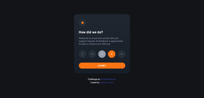
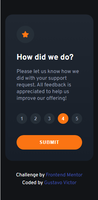
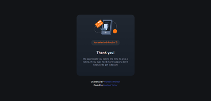
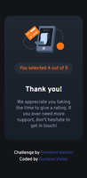

# Frontend Mentor - Interactive rating component solution

Este projeto é uma aplicação React e também uma solução do desafio [Interactive rating component](https://www.frontendmentor.io/challenges/interactive-rating-component-koxpeBUmI) do Frontend mentor sendo que o Frontend Mentor é uma plataforma de desafios que te ajuda a melhorar suas habilidades de codificação e desenvolviemnto através da construção de projetos reais. 

## Tabela de conteúdos

- [Visão Geral](#visão-geral)
  - [O desafio](#o-desafio)
  - [Screenshots](#screenshots)
  - [Links](#links)
- [Meu processo](#meu-processo)
  - [Tecnologias e Ferramentas](#tecnologias-e-ferramentas)
- [Autor](#author)
- [Licença](#licença)

## Visão Geral

### O desafio

Usuários são capazes de:

- [x] Ver o layout ideal para o aplicativo, dependendo do tamanho da tela do dispositivo
- [x] Ver os estados de foco para todos os elementos interativos na página
- [x] Selecionar e enviar uma avaliação numérica
- [x] Ver o estado do cartão de "obrigado" depois de enviar uma avaliação

### Screenshots

 

 

### Links

- [Aplicação no Codesandbox](https://oe38hh-5173.csb.app/)

## Meu processo

### Tecnologias e Ferramentas

- [HTML5](https://developer.mozilla.org/pt-BR/docs/Web/HTML)
- [SASS](https://sass-lang.com/) 
- [ReactJS](https://reactjs.org/) - biblioteca JS 
- [Vite](https://vitejs.dev/)
- [Codesabdbox](https://codesandbox.io)
- Fontes: 
    - [Overpass (400, 700)](https://fonts.google.com/specimen/Overpass) 

## Autor

- Website - [gustavovictor](http://gustavovictor.me/)
- Frontend Mentor - [@Gustavo-Victor](https://www.frontendmentor.io/profile/Gustavo-Victor)
- CodePen - [@gustavo_victor](https://codepen.io/gustavo_victor)

## Licença

Este projeto está sob a licença [MIT](./LICENSE.md) 

Qualquer pessoa pode usar e contribuir com este projeto ✌

